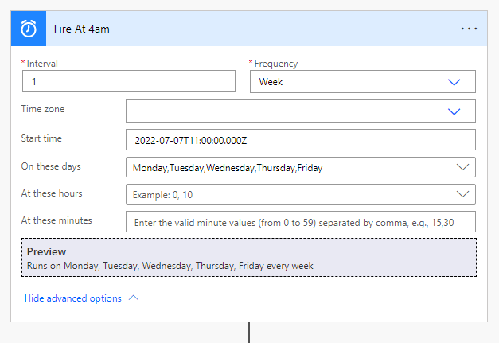
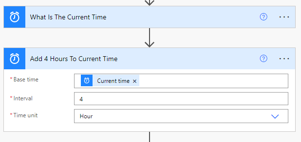
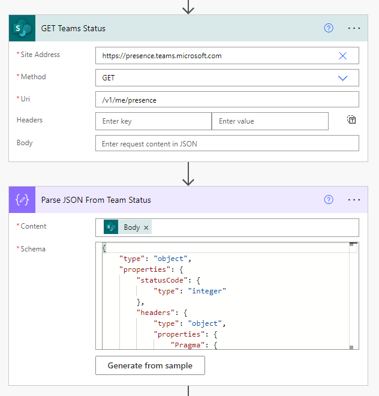
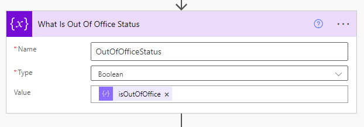
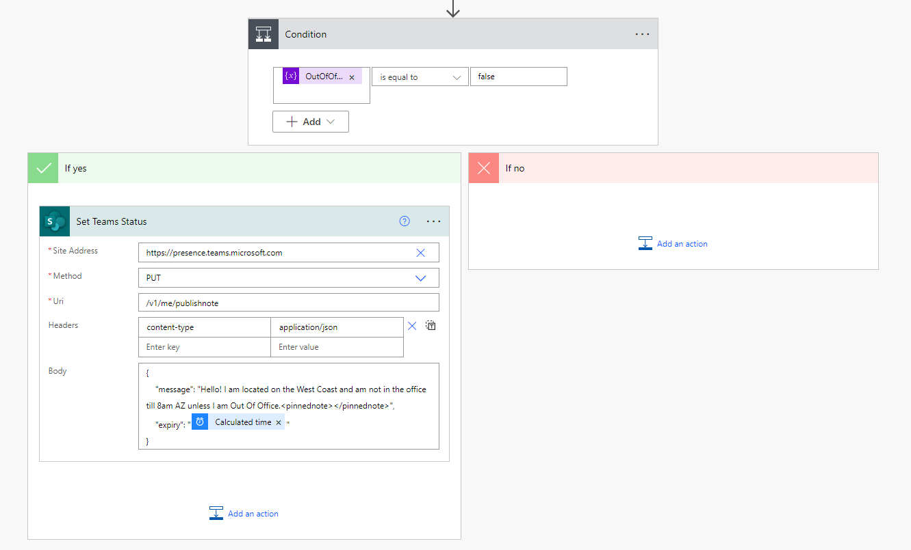
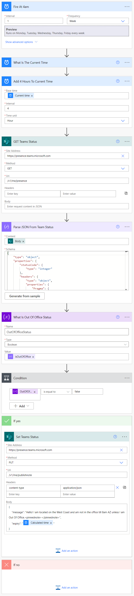

# Set Team Status Using Microsoft Flow (Power Automate)
***
When it comes to working with a company that is national, some people will forget what timezone you are in and message you at 4am your time. This informs the user messaging you that your shift has not started yet. All times within this guide are UTC-0 (ZULU)

1. Fire Off Flow
    - This tells Flow when to execute.

2. Current Time and Ask What Will It Be In 4 Hours
    - You want to grab the current time first then create a rule that add time. This is all up to how you would like it. My setup is set to fire at 4am AZ. Then add 4 hours so it becomes 8am AZ.

3. Query Current Team Status and Parse The Body
    - Make an API call to Sharepoint to GET your current status. We will be doing this to detect when you are Out Of Office. For the schema, refer to the folder for an example.

        - Site Address: https://presence.teams.microsoft.com
        - Method: GET
        - Uri: /v1/me/presence

4. Set The Out Of Office Variable

5. Set Status When Not Out Of Office
    - Finally you will create a condition that if we are not Out Of Office, Teams will set the status message.

        - Site Address: https://presence.teams.microsoft.com
        - Method: PUT
        - Uri: /v1/me/presence
        - Headers:
            - Content-Type: application/json
        - Body:
            - `{
            "message": "Hello! I am located on the West Coast and am not in the office till 8am AZ unless I am Out Of Office.<pinnednote></pinnednote>",
            "expiry": "@{body('Add_4_Hours_To_Current_Time')}"
            }`

# Full Power Automate
***

