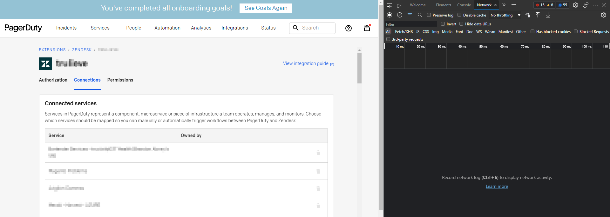
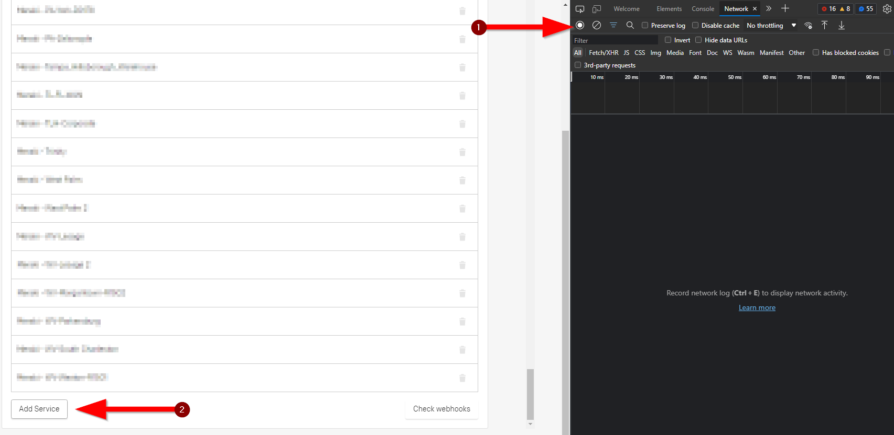
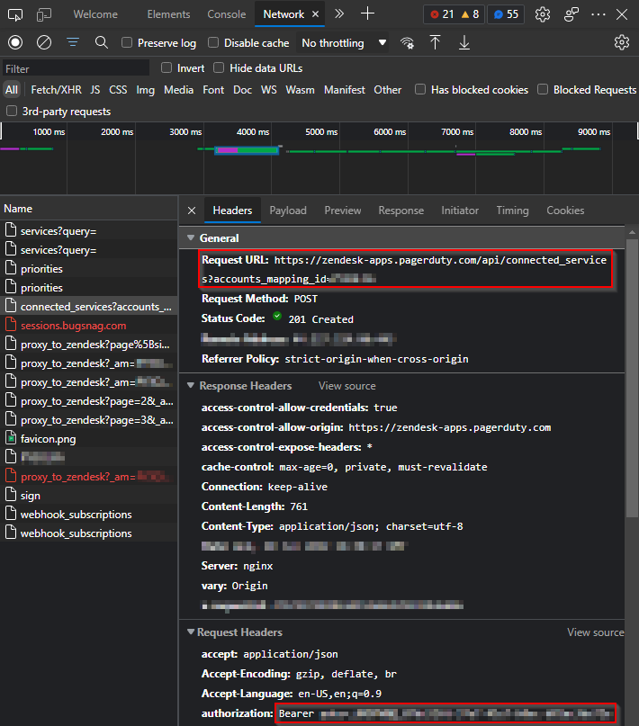
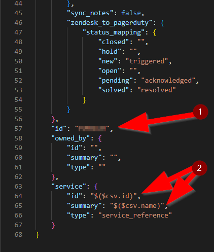
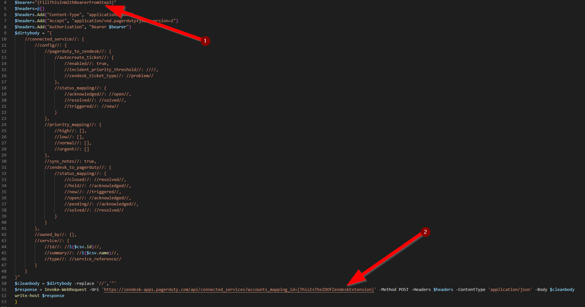
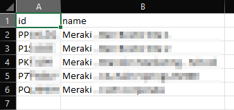
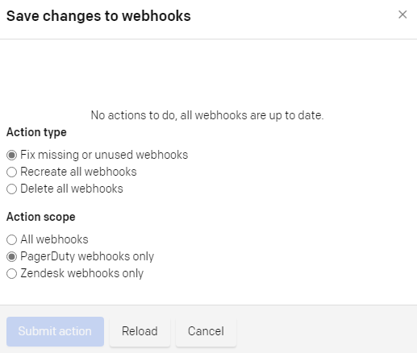

# Create Multiple Services Within The Zendesk Extension
***
Currently there is a limitation within PagerDuty that you are not able to add multiple Services/Connections. I have discovered a way to bypass this by doing a simple network trace.

1. Launch Your Favorite Web Browser
- I usually use Edge at work. Once the browser is open, navigate to your PagerDuty extension with the dev console open (F12).

2. Start The Netwok Log
- Go ahead and start the network log. Once it has been started, add a service. After the service has been added, stop the network log.

3. Find the POST Request
- In the network log you should have an item that starts with connected_services. Click on it. There it will have the Request URL and your Bearer token that we will need for later.

4. Create The Default Settings
- Click on the service you created. Once you adjust the settings, make sure to save all three areas.

5. Make a GET To PagerDuty
- Load up your favorite API calling program. Make a GET to the URL you found in Step 3. That will list the services that you have created. Locate the one you just created. Copy it.

6. Modify the JSON body
- Paste the JSON body in your favorite code editor. Remove the id variable (#1). Then change the id and summary variables to match mine (#2).

7. Create the PowerShell Script
- I have added a templated PS1 that you can use for a lot of different API calls. In that script, you will need to add your Bearer from Step 3 (#1). Then paste the JSON body into the Dirty Body variable. Once it is pasted in there, replace all " with //. Then lastly, for Invoke-WebRequest use the URL you found in Step 3 (#2).

8. Create CSV For Import
- Now you need to create a CSV with one column containing the unique service ID. Then the other column would contain the service name.

9. Run The PowerShell Script Against The CSV
- Now execute the script with the CSV.

10. Create The Webhooks In PagerDuty
- Once the scipt has finished executing, go back to PagerDuty and click "Check webhooks" on the connections page. A box will popup and you will only want to select these options. After that, you are good to go.

