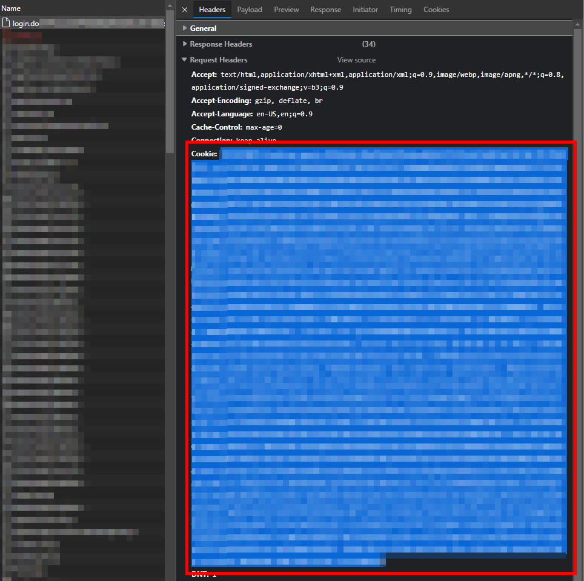
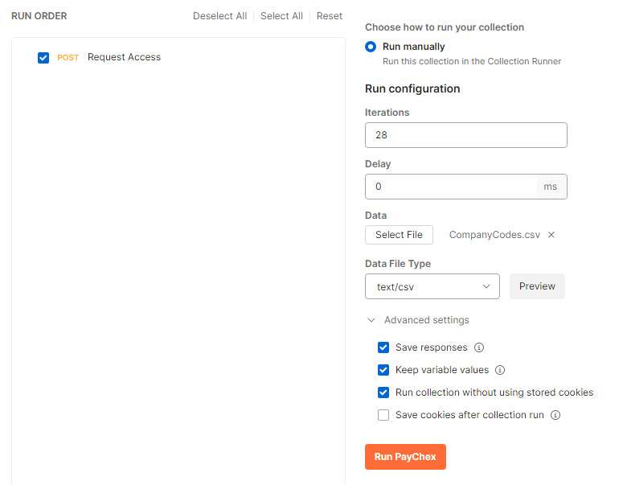

# Send Multiple PayChex Company Code Requests With Postman
***
Requesting a Company Code to be added to your PayChex Flex account requires you to manually send multiple requests. With this API call via Postman, you can upload a CSV and have it send the requests for you.

1. Launch Your Favorite Web Browser
    - I usually use Edge at work. Once the browser is open, navigate to the PayChex Flex login with the dev console open (F12).

2. Start The Network Log
    - Go ahead and start the network log. Once it has been started, login to PayChex Flex.

3. Find the GET Request
    - In the network log you should have an item that starts with login.do. Click on it. Inside the Request Headers there will be a header called Cookie. Copy the value assigned to it.

4. Create the Postman request
    - Create a POST request inside of Postman with the details below

        - Type: POST
        - Uri: https://apps.myapps.paychex.com/userAccess_remote/do/json/userRemote/saveChangeRequestForUser
        - Headers:
            - Cookie: {Paste the value from Step 3}
        - Body:
            - `{
            "ns": "com.paychex.framework.remoting.dto.RemoteObjectRequest",
            "destination": "userRemote",
            "operation": "saveChangeRequestForUser",
            "params": [
            {
            "clientAccountNbr": "{{CompanyCode}}",
            "ssoGuid": "{{ssoGuid}}",
            "ldapType": "EXTERNAL",
            "changeType": "CLIENT_ACCESS",
            "comment": "Hello,\n\nI would like to request access to your company.\n\nThank you,\n{{name}}",
            "submitterSsoGuid": "{{ssoGuid}}",
            "submitterLdapType": "EXTERNAL",
            "requestedRoleId": "",
            "requestingClientContactName": "",
            "requestingVerificationFileLocation": "",
            "ns": "com.paychex.userAccess.dto.approvals.SaveChangeRequestForUserRequest"
            }
            ]
            }`

5. Create the CSV
    - Inside the repo is an example CSV. You need to format the CSV to contain the Company Code, ssoGuid and name that will appear on the requests.

        - ssoGuid is the userGuid located in Step 3

6. Run the Collection
    - Open up Postman to run the collection with the below settings selected.

7. Verify the Responses
    - Look at each of the response bodies. They should tell you that there is a pending request now.