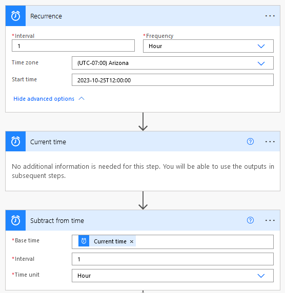
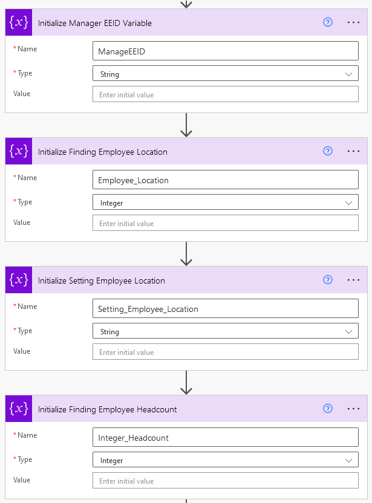
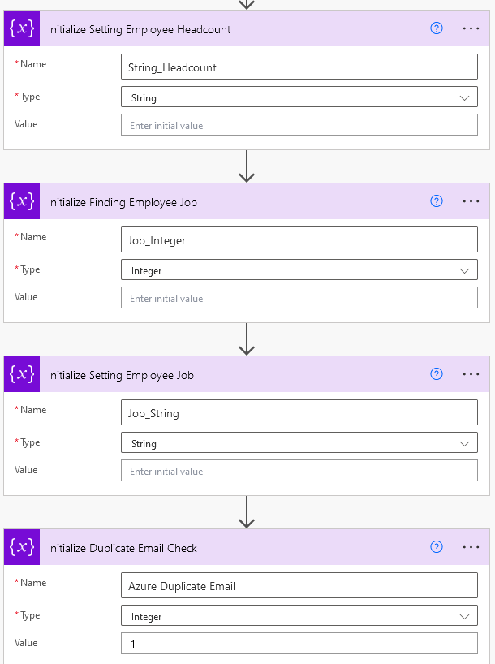
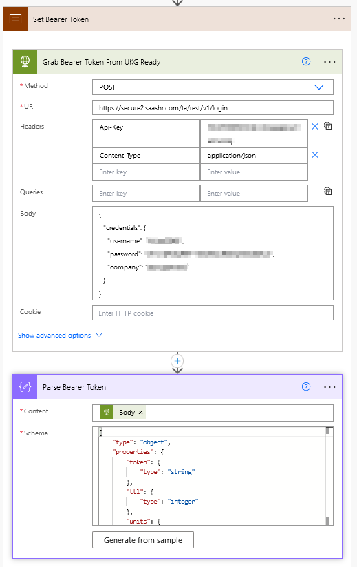
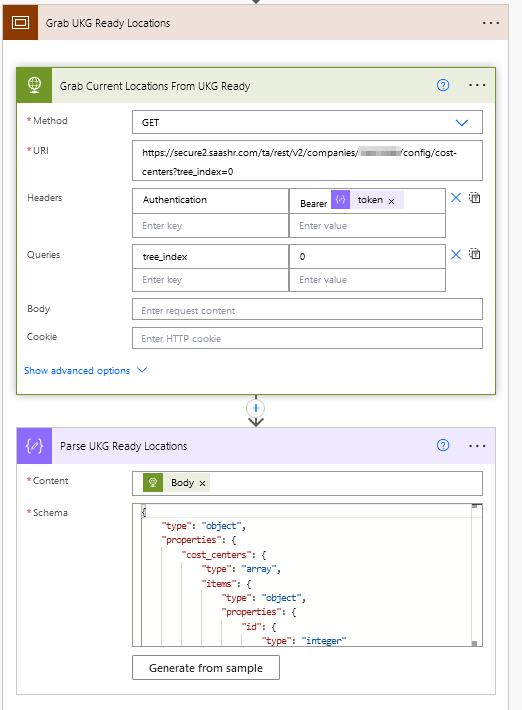
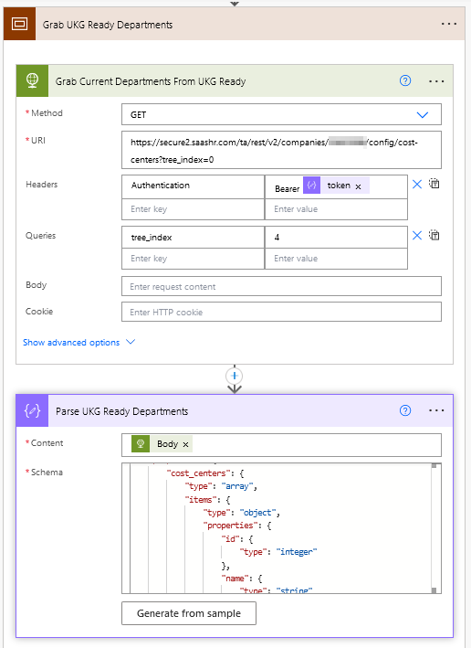
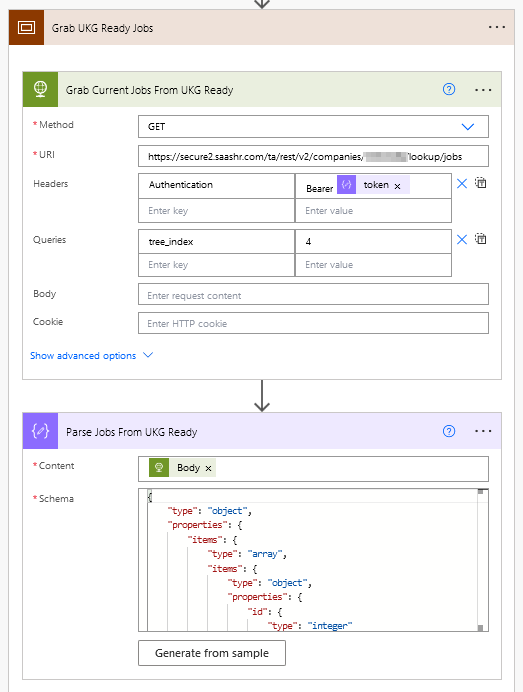
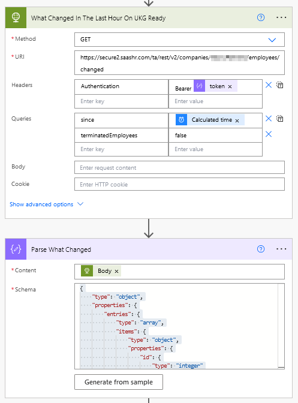

# Automatically Create Users When Onboarded in UKG Ready
***
UKG Ready is a basic version of TLM/HR/Payroll software that UKG offers. Natively there is not a way to enable SCIM to provision/deprovision employees. With this Flow, we will be able to provision people automatically from UKG Ready to Azure once they have completed onboarding. Also, it will update employee's Job Title, Location and Department.

## ***Note: I am still building out this documentation***

1. Gather Credentials
    - For this Flow to work correctly, we will need an API user created in UKG Ready with a security profile to read various varriables.
    - Next we will need to create a Azure App Registration that has these permissions granted from Microsoft Graph, User.ReadWrite.All and UserAuthenticationMethod.ReadWrite.All
    - [API Documentation for UKG Ready](https://secure.saashr.com/ta/docs/rest/public/)

2. Inital Flow Setup
    - So far I have not found a way to create/update a user in real time that includes Job Title, Location and Department.
    - A workaround that I found was to use the [v2 Changed employee](https://secure.saashr.com/ta/docs/rest/public/?r=__v2__companies__(cid)__employees__changed#get) GET.
    - If I run this GET every hour and look for the past creations/modifications for the hour, I will be able to parse the response and execute various commands.
    - In the first setup, we will tell the flow when to fire and to grab the time from 1 hour ago.

3. Setting Variables

4. Grabbing Job Titles/Locations/Departments From UKG Ready

5. Grab What Employee's Have Been Created/Modified

# Full Power Automate
***

