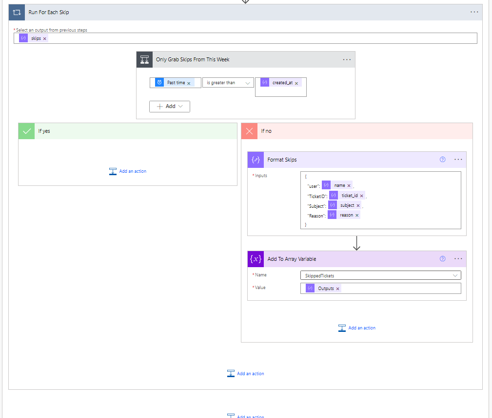
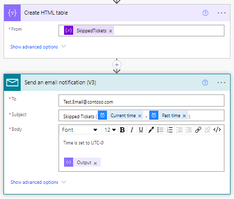

# Automated Email On Skipped Tickets Using Microsoft Flow (Power Automate)
***
Zendesk does not offer a built-in way to view skipped tickets for Agents. Only Admins can view them. I have created a way that uses Microsoft Flow. In summary, it queries who is assigned the Guided View role, then for each user it reads the skips from the previous 7 days, creates an array from them, then fires off an email with the HTML table embedded.

1. Fire Off Flow
This tells Flow when to execute.

2. Current Time and Ask What Was A Week Ago
You want to grab the current time first then add the past time rule. This will help filter skips from a certain time frame.

3. Query Guided Mode Role and Parse Agents
Now you want to make an API call to the Custom Role that the Agents use for Guided Mode. Select the body from the previous role and add your schema. (Schemas are uploaded here if you want to use them)

4. Setup The Array

5. Run For Each User
This is where you will be grabbing the most data for the skipped tickets. Create another HTTP GET which will run for each User ID detected in Step 3. After you will need to parse the output once again. (Schemas are uploaded here if you want to use them)

6. Run For Each Skip
Now you will want to only grab the last 7 days of skips.

7. Finally Create Table and Email
Bingo. Simple as that.

