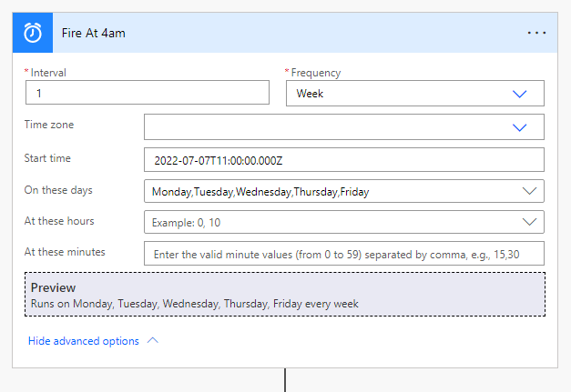
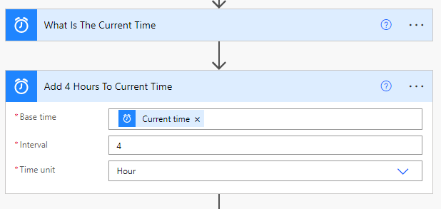
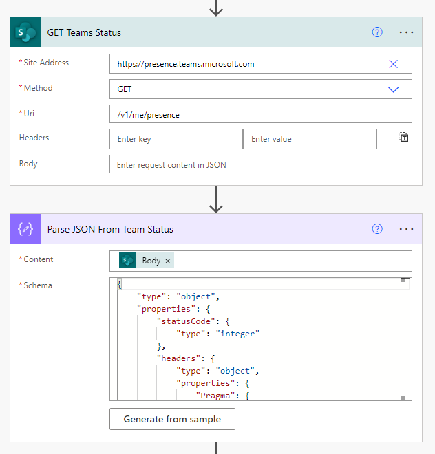
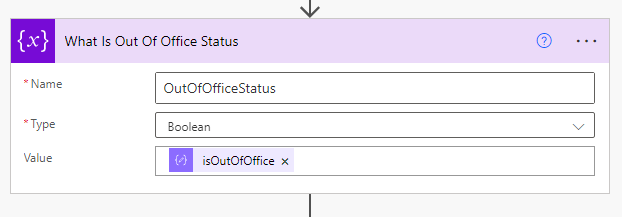
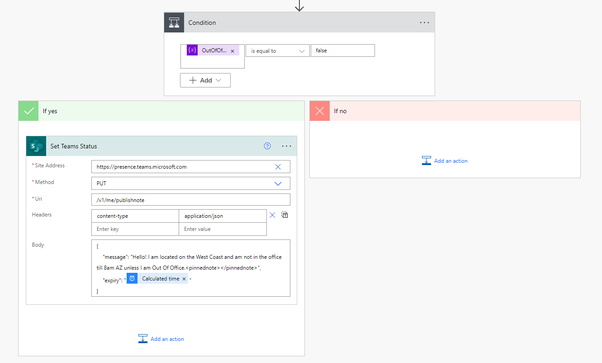
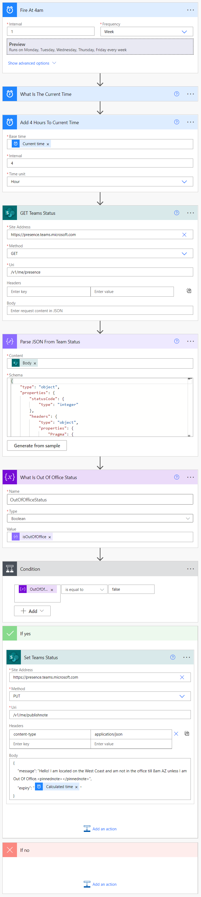

# Set Team Status Using Power Automate

When working with a national or global company, colleagues may forget your timezone and message you outside your working hours (e.g., at 4:00 AM). This Power Automate flow sets a custom Teams status message to inform users that your shift has not started yet.

> [!NOTE]
> All times within this guide are configured in **UTC-0 (Zulu)**.

---

## Step-by-Step Guide

### 1. Trigger the Flow
Configure a recurrence trigger to define when this Power Automate flow should execute (e.g., daily at your starting hour).



### 2. Calculate Expiry Time
Retrieve the current time and calculate when the status should expire (e.g., in 4 hours).
*   *Example setup:* Fire at 4:00 AM Arizona (AZ) time, add 4 hours, so the status message expires at 8:00 AM AZ time.



### 3. Query Current Team Status & Parse JSON
Make an HTTP API call to SharePoint/Teams presence to fetch your current status. This is used to detect if you are currently marked as *Out of Office*.
*   **Site Address:** `https://presence.teams.microsoft.com`
*   **Method:** `GET`
*   **URI:** `/v1/me/presence`
*   **JSON Schema:** Refer to [parse-teams-status.json](schemas/parse-teams-status.json) for the parse schema.



### 4. Set the Out Of Office Variable
Evaluate and store the Out of Office status.



### 5. Set Status When Not Out Of Office
Create a condition: if you are **not** Out of Office, make a PUT request to Teams presence to set your custom status message.
*   **Site Address:** `https://presence.teams.microsoft.com`
*   **Method:** `PUT`
*   **URI:** `/v1/me/presence`
*   **Headers:**
    *   `Content-Type: application/json`
*   **Body:**
    ```json
    {
      "message": "Hello! I am located on the West Coast and am not in the office till 8am AZ unless I am Out Of Office.<pinnednote></pinnednote>",
      "expiry": "@{body('Add_4_Hours_To_Current_Time')}"
    }
    ```



---

## Full Power Automate Workflow

Below is the complete high-level overview of the Power Automate workflow.


