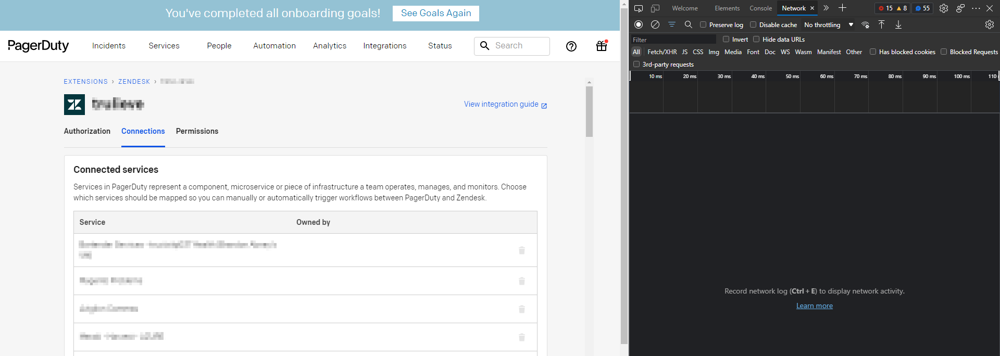
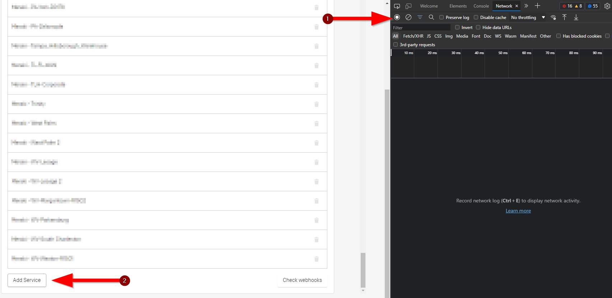
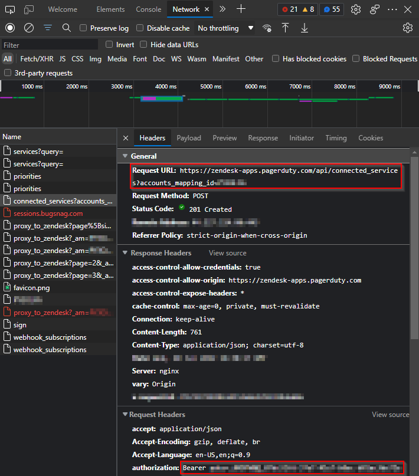
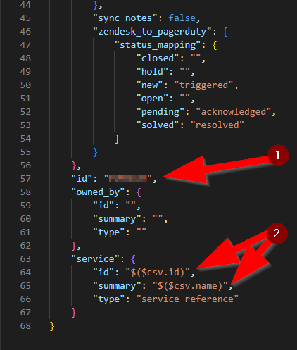
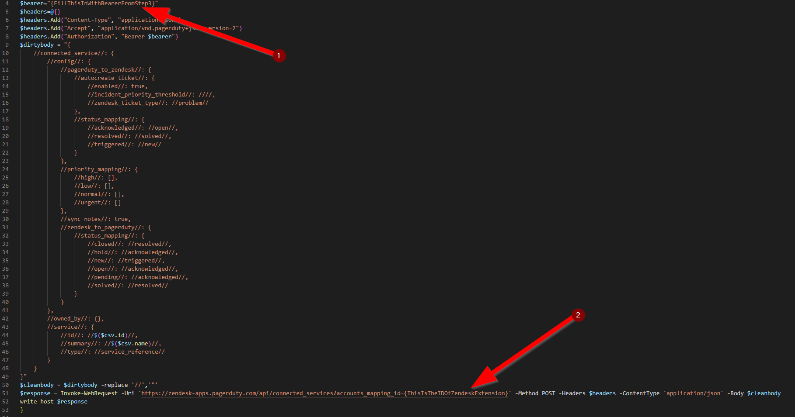
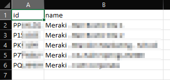
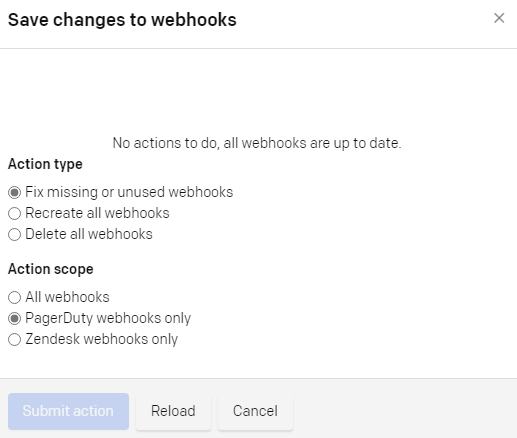

# Create Multiple Services Within the Zendesk Extension

PagerDuty currently limits users from adding multiple services or connections simultaneously through the Zendesk extension interface. This guide details a walk-around utilizing network analysis to batch-provision multiple Zendesk integration connections.

---

## Step-by-Step Guide

### 1. Launch Developer Console
Open your web browser (e.g., Microsoft Edge or Google Chrome), open the **Developer Tools (F12)**, and navigate to the PagerDuty Extension configuration page.



### 2. Capture Network Log
1.  Navigate to the **Network** tab in Developer Tools.
2.  Add a single service manually inside PagerDuty.
3.  Stop the network trace once the connection has been successfully added.



### 3. Retrieve API Authorization Details
Find the POST request in the network log starting with `connected_services`.
*   Click on the request to retrieve the **Request URL** (which contains your unique `accounts_mapping_id`).
*   Retrieve the **Bearer Token** from the `Authorization` header under the Request Headers tab.



### 4. Create Default Integration Settings
Configure your newly added service connection in the UI exactly how you want it, making sure to save settings for all three areas (Trigger, Acknowledge, Resolve).

### 5. Fetch Integration Body Structure
Use an API testing program (like Postman) to perform a `GET` request to the URL discovered in Step 3. Find the service you just configured in the JSON response array and copy its JSON structure.

### 6. Clean the JSON Template
Paste the JSON into your code editor:
1.  Remove the unique `id` variable.
2.  Standardize the structure to match the sample payload format shown below, preparing placeholders for your CSV mapping properties (like `id` and `summary`).



### 7. Configure the PowerShell Script
Open [New-ZendeskConnections.ps1](New-ZendeskConnections.ps1) in your code editor:
1.  Replace `{FillThisInWithBearerFromStep3}` with your actual Bearer Token copied in Step 3.
2.  Replace `{ThisIsTheIDOfZendeskExtension}` with the account mapping ID found in the Request URL in Step 3.
3.  Optionally customize the JSON settings in `$dirtybody` (with double slashes `//` instead of quotes to allow inline expansion).



### 8. Prepare the Import CSV
Create a CSV file with two columns:
*   `id`: The unique PagerDuty service ID.
*   `name`: The display name of the PagerDuty service.

An example is structured as:
```csv
id,name
P123456,Billing Service
P987654,API Platform
```

### 9. Run the Script Against the CSV
Execute the PowerShell script in a terminal, passing in the path to your CSV file:
```powershell
.\New-ZendeskConnections.ps1 -csv_file "path\to\services.csv"
```



### 10. Complete Webhook Provisioning
Once execution completes:
1.  Go back to the PagerDuty connections page.
2.  Click **Check webhooks**.
3.  Select the appropriate synchronization options in the pop-up modal and save.

