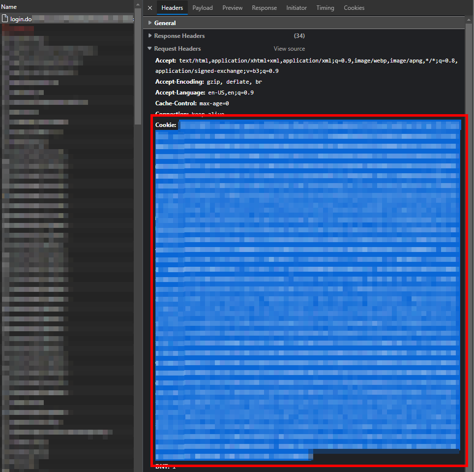
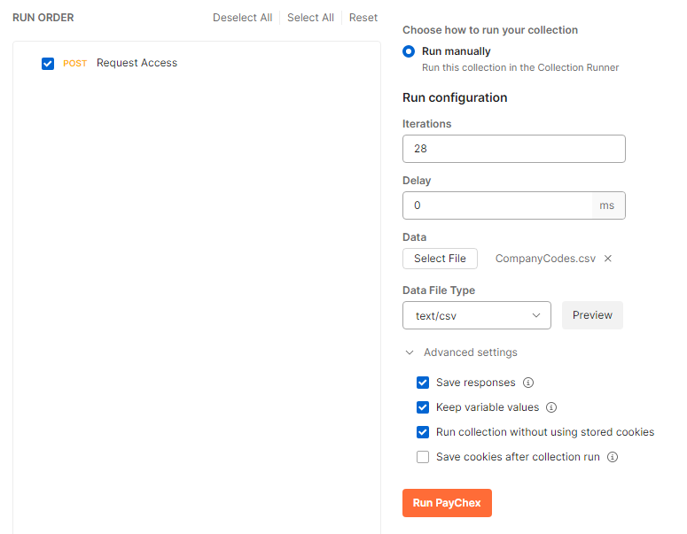

# Send Multiple Paychex Company Code Requests With Postman

Requesting a Company Code to be added to your Paychex Flex account requires you to manually send multiple individual requests. With this Postman configuration, you can upload a CSV file and batch-send the requests automatically.

---

## Step-by-Step Guide

### 1. Open Browser Console
Open your web browser (e.g., Microsoft Edge or Google Chrome), open the **Developer Tools (F12)**, and navigate to the Paychex Flex login page.

### 2. Capture Login Cookie
1.  Navigate to the **Network** tab in Developer Tools.
2.  Log in to Paychex Flex.
3.  Find the network request starting with `login.do`. Under the **Request Headers** section, find the `Cookie` header and copy its entire value.

### 3. Retrieve User SSO GUID
Locate the `ssoGuid` or `userGuid` property within the request headers or response body in Step 2. You will need this GUID for mapping the requests.



### 4. Configure Postman Request
Create a new `POST` request inside Postman with the following parameters:
*   **Method:** `POST`
*   **URL:** `https://apps.myapps.paychex.com/userAccess_remote/do/json/userRemote/saveChangeRequestForUser`
*   **Headers:**
    *   `Cookie`: `{Paste your copied cookie value from Step 2}`
*   **Body (raw JSON):**
    ```json
    {
      "ns": "com.paychex.framework.remoting.dto.RemoteObjectRequest",
      "destination": "userRemote",
      "operation": "saveChangeRequestForUser",
      "params": [
        {
          "clientAccountNbr": "{{CompanyCode}}",
          "ssoGuid": "{{ssoGuid}}",
          "ldapType": "EXTERNAL",
          "changeType": "CLIENT_ACCESS",
          "comment": "Hello,\n\nI would like to request access to your company.\n\nThank you,\n{{name}}",
          "submitterSsoGuid": "{{ssoGuid}}",
          "submitterLdapType": "EXTERNAL",
          "requestedRoleId": "",
          "requestingClientContactName": "",
          "requestingVerificationFileLocation": "",
          "ns": "com.paychex.userAccess.dto.approvals.SaveChangeRequestForUserRequest"
        }
      ]
    }
    ```

### 5. Create Mapping CSV
Format a CSV file containing the necessary columns: `CompanyCode`, `ssoGuid`, and `name`. 
*   An example CSV structure is provided in the repository at [company-codes-examples.csv](company-codes-examples.csv).
*   *Note:* `ssoGuid` is the user GUID retrieved in Step 3.

### 6. Run the Postman Collection
Open Postman's **Runner** and run the request collection with the following settings selected:
*   Select your CSV file as the Data Source.
*   Verify that Postman maps the column variables (`CompanyCode`, `ssoGuid`, `name`) correctly.



### 7. Verify Responses
Inspect each response body in the runner console. They should indicate that a change request was successfully created and is now pending.