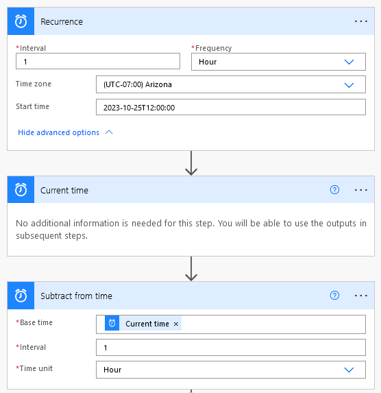
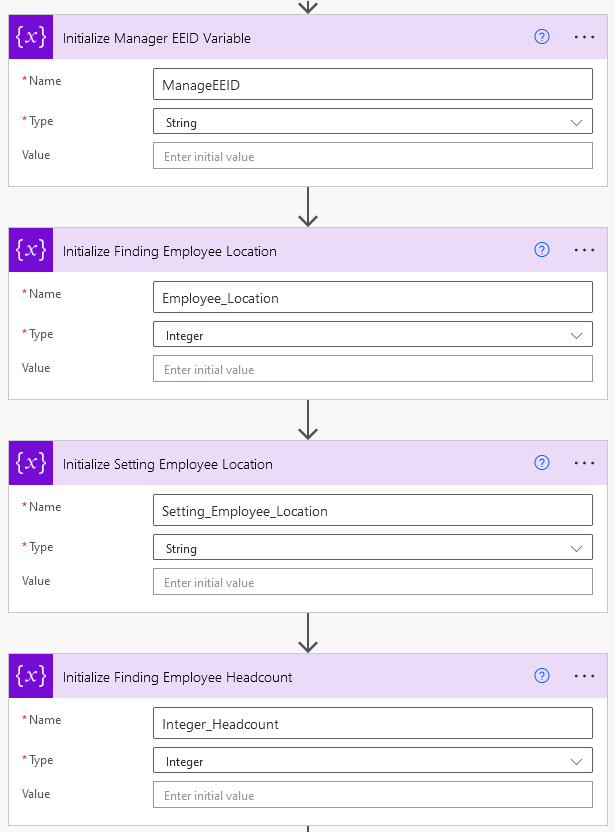
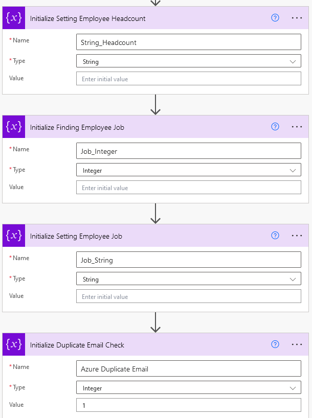
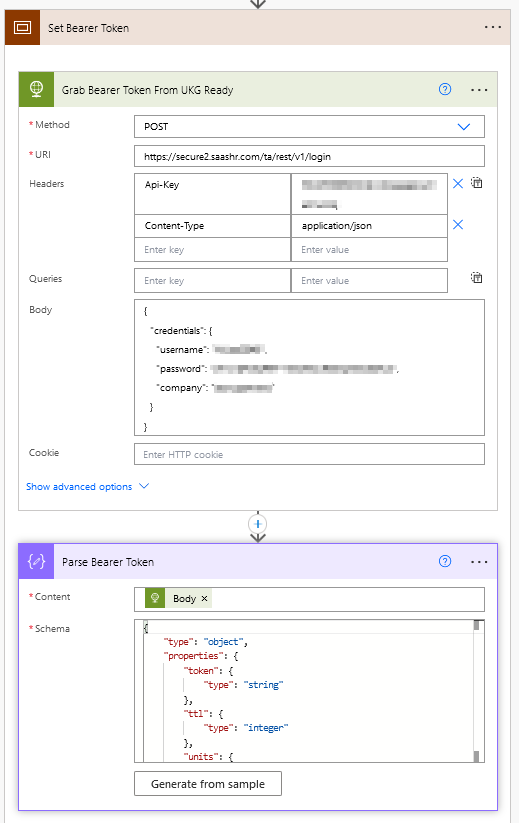
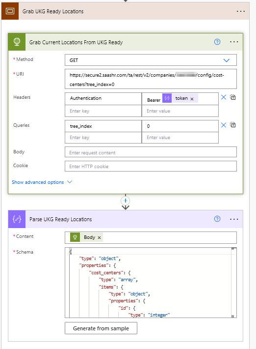
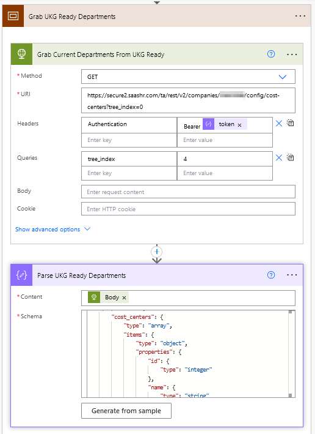
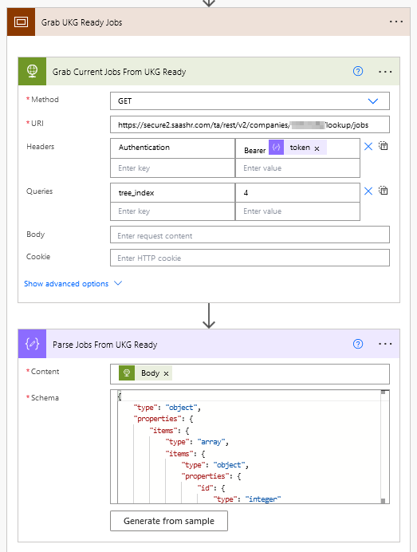
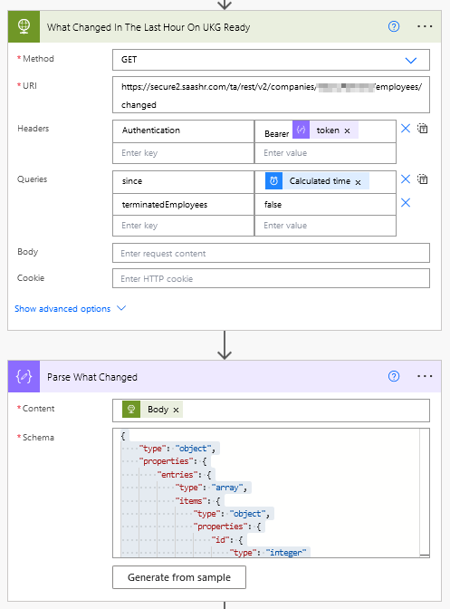

# Automatically Create Users When Onboarded in UKG Ready

UKG Ready is a basic human resources, payroll, and time management software. Natively, it does not support SCIM (System for Cross-domain Identity Management) to provision or deprovision employees. This Power Automate flow fills this gap, automatically provisioning new hires from UKG Ready to Azure Active Directory (Entra ID) upon onboarding, and synchronizing their Job Title, Location, and Department.

> [!WARNING]
> This documentation is currently a work in progress.

---

## Technical Prerequisites

To configure this flow, you will need:
1.  **UKG Ready API User**: An API service account created within UKG Ready equipped with a security profile configured to read employee records.
    *   *Reference:* [UKG Ready REST API Documentation](https://secure.saashr.com/ta/docs/rest/public/)
2.  **Azure App Registration**: An application registered in Microsoft Entra ID with the following Microsoft Graph permissions granted:
    *   `User.ReadWrite.All`
    *   `UserAuthenticationMethod.ReadWrite.All`

---

## Step-by-Step Guide

### 1. Define Execution Interval
Because real-time event webhooks for attributes like Job Title, Location, and Department are restricted, this flow runs on a recurring schedule (e.g., hourly).
*   The flow queries the UKG Ready API using the [V2 Changed Employees GET](https://secure.saashr.com/ta/docs/rest/public/?r=__v2__companies__(cid)__employees__changed#get) endpoint.
*   It looks for any creations or modifications that occurred within the last 1 hour, then parses the response.

### 2. Configure Power Automate Variables
Define variables for your Azure Client ID, Client Secret, Tenant ID, and UKG Ready API credentials.

### 3. Fetch Organizational Entities from UKG Ready
Retrieve active departments, job titles, and locations from UKG Ready to map them accurately during provisioning.
*   **JSON Schemas:** Refer to these schema definitions in the repository:
    *   [parse-bearer-token.json](schemas/parse-bearer-token.json)
    *   [parse-employee-info.json](schemas/parse-employee-info.json)
    *   [parse-jobs-from-ukg-ready.json](schemas/parse-jobs-from-ukg-ready.json)
    *   [parse-ukg-ready-departments.json](schemas/parse-ukg-ready-departments.json)
    *   [parse-ukg-ready-locations.json](schemas/parse-ukg-ready-locations.json)
    *   [parse-what-changed.json](schemas/parse-what-changed.json)

### 4. Process Created and Modified Employees
Query the changed employees list and filter the results.

---

## Full Power Automate Workflow

Below is the complete overview of the Power Automate configuration.

