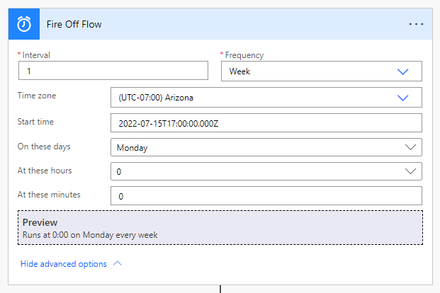
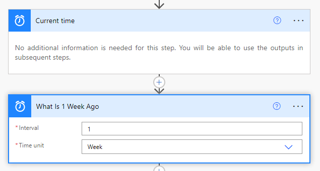
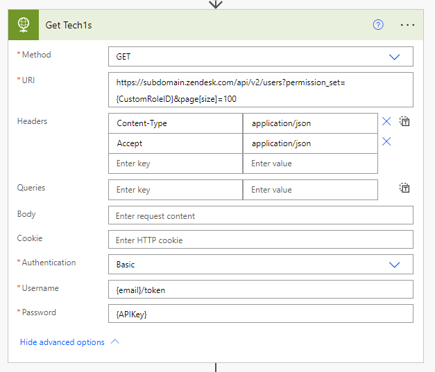
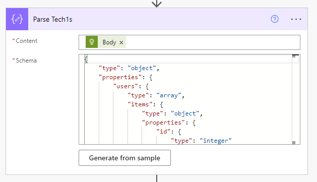
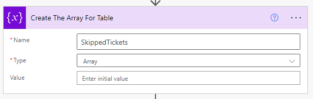
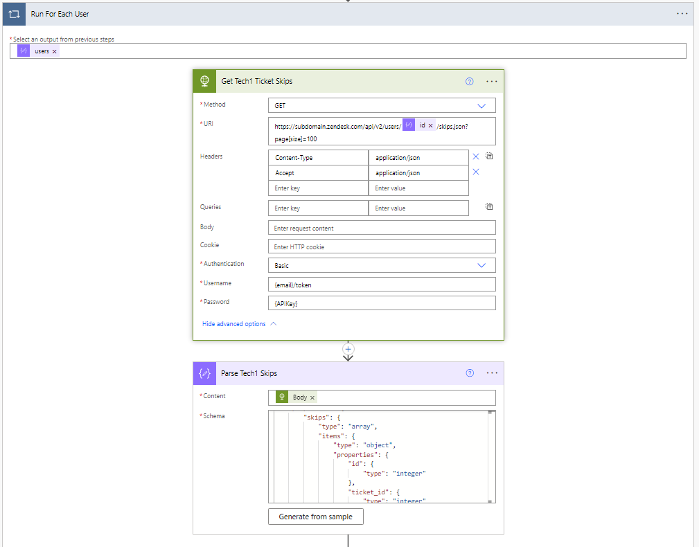
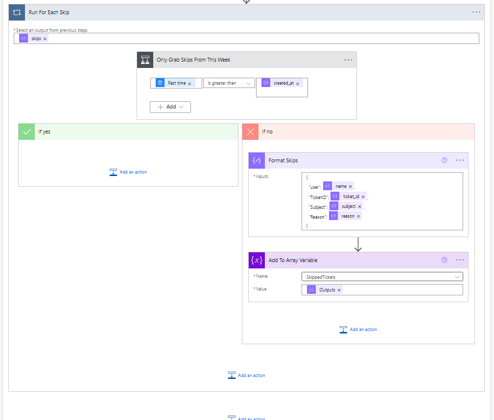
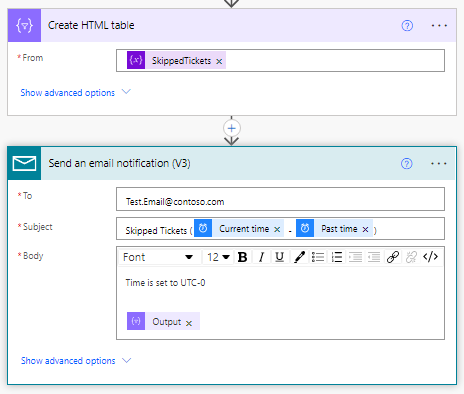
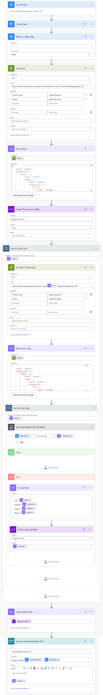

# Automated Email on Skipped Tickets

Zendesk does not natively offer agents a way to view their skipped tickets; only administrators have visibility into this data. This Power Automate flow queries which agents are assigned the Guided View role, reads each user's ticket skips from the previous 7 days, compiles the data into an array, and emails them a structured HTML summary table.

---

## Step-by-Step Guide

### 1. Trigger the Flow
Configure a recurrence trigger in Power Automate to define when this batch process should execute.

### 2. Calculate Search Window
Retrieve the current time and calculate a timestamp for 7 days ago. This acts as the filtering boundary for skips.

### 3. Query Guided Mode Agents & Parse JSON
Make an API call to fetch all users belonging to the custom Guided Mode agent role.
*   **API Endpoint:** `https://{subdomain}.zendesk.com/api/v2/users?permission_set={CUSTOM_ROLE_ID}&page[size]=100`
    *   *Subdomain:* Your unique Zendesk subdomain.
    *   *CUSTOM_ROLE_ID:* The ID located in the URL when [modifying the Custom Role](https://support.zendesk.com/hc/en-us/articles/4408832292506-Managing-custom-roles).
*   **Headers:**
    *   `Content-Type: application/json`
    *   `Accept: application/json`
*   **Authentication:** Basic (Use `{YOUR_EMAIL}/token` as username and your Zendesk API key as password).
*   **JSON Schema:** Refer to [parse-agents.json](schemas/parse-agents.json) for the parse schema.

### 4. Initialize Data Array
Initialize a global array variable in Power Automate to compile the collected ticket skip logs.

### 5. Query Ticket Skips per User
For each Agent ID detected in Step 3, perform a `GET` request to retrieve their individual ticket skips.
*   **API Endpoint:** `https://{subdomain}.zendesk.com/api/v2/users/@{items('Run_For_Each_User')?['id']}/skips.json?page[size]=100`
*   **JSON Schema:** Refer to [parse-skips.json](schemas/parse-skips.json) for the parse schema.

### 6. Filter and Compile Skips
Iterate through each skip event and filter for records that occurred within the past 7 days. Append valid skips to your initialized array.

### 7. Generate HTML Table and Email
Construct a clean HTML table from the collected skips array and email it directly to the designated administrator or team lead.

---

## Full Power Automate Workflow

Below is the complete overview of the Power Automate configuration.

